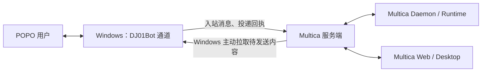

# Multica × DJ01Bot：POPO 全链路集成落地计划

## 1. 目标与交付约定

实现以下完整流程：

**用户在 POPO 交代工作 → Multica 创建会话或任务 → Multica Runtime 执行 → 结果回到原对话 → 用户继续追问、确认或取消 → Multica 保留完整记录。**

已确定的方案：

- **Multica 统一管理身份、会话、任务和执行。** DJ01Bot 负责 POPO 连接、消息解析、媒体和回复投递。
- **服务端＋Windows 通道部署。** Windows 主动连接 Multica，服务端无需直接访问 Windows 内网端口。
- **先验收任务闭环，再补齐当前飞书体验。** 两部分均为必交付，第一阶段完成不代表整个集成完成。
- 人工决策采用**任务评论和明确回复**；沿用 Multica 的运行机制，不增加逐工具审批协议。
- 管理入口覆盖 Multica Web/Desktop；真实消息验收覆盖 POPO 桌面端和移动端。Multica Mobile 验证既有会话、任务展示兼容性，不新增连接管理页面。

文档落盘目标：本文件 `docs/popo-dj01bot-integration-plan.md`（本 worktree：`G:\workspace\multica-popo`）。

## 2. 全链路设计

### 架构与职责



- 在 Multica 增加 `popo` 渠道，复用 Channel Engine 的身份解析、会话、命令和任务服务。
- 使用外部连接器模式：服务端注册 POPO ResolverSet，POPO 连接由 Windows 通道进程持有，避免两端同时建立机器人连接。
- DJ01Bot 增加独立入口 `python -m nanobot.multica_bridge`，复用 POPO 传输组件；该进程不启动 DJ01Bot AgentLoop、Sparse 调度或独立 OpenCode 会话。
- 需要访问内部工具的 Agent，绑定运行在相应 Windows 主机上的 Multica Runtime。技能通过 Multica 既有配置管理，OpenViking 整体迁移不纳入本次。

### A. 通道注册、机器人绑定与权限

1. 工作区 owner/admin 在 Multica 创建一次性通道配对凭证；Windows 通道完成配对，取得仅限该工作区的专用凭证。
2. Multica 智能体的“集成”页新增 POPO：选择在线 Windows 通道，连接已有空闲机器人，或发起扫码创建。
3. 扫码流程复用 DJ01Bot 现有实现；将 Qt 中可复用的注册逻辑提取为无 UI 依赖模块。Windows 保存机器人密钥，服务端只保存机器人公开身份和绑定关系。
4. 一个 POPO Bot 只能绑定一个有效的 Multica Agent。普通 DJ01Bot、Sparse、Multica 对同一机器人互斥；使用现有机器人锁和服务端唯一约束共同检查。
5. 机器人安装、解绑权限对齐飞书：Agent 所有者及工作区 owner/admin 可管理；通道主机的配对、凭证撤销仅限工作区 owner/admin。
6. 解绑先由服务端提交撤销，再停止接收和投递；保留既有任务、会话与审计记录。

**成员身份单独绑定：**

- POPO 用户首次使用时，通过私聊收到 Multica 账号绑定链接；群内仅提示完成绑定，不发送可被他人兑换的绑定凭证。
- 绑定令牌采用现有单次兑换、15 分钟有效、只保存哈希的机制。
- 每次操作重新校验工作区成员资格及 Agent 调用权限，不能把通道凭证当作用户授权。
- DJ01Bot 增加仅供 Multica 通道使用的入站授权策略，允许经过验证的 POPO 发送者进入服务端身份校验；普通机器人和 Sparse 的 owner 规则保持原语义，禁止通过清空 owner 绕过限制。

### B. 会话、任务与后续操作

| 用户操作 | 确定行为 |
|---|---|
| 私聊普通消息 | 进入该机器人对应的 Multica Chat，并触发一次正常运行 |
| 群聊 `@Bot` | 校验发送者后进入对应群会话；未明确 @ 的消息不触发执行 |
| `/issue 标题`，后续行写描述 | 使用共享 IssueService 创建任务，分配给绑定 Agent，返回任务编号及链接 |
| `/new [消息]` | 新建 Chat 并切换外部会话路由，保留旧 Chat |
| `/clear [消息]` | 保留 Chat 历史，开启新的 Agent 可见上下文 |
| 引用任务回复并继续提问 | 按持久消息关联定位 Issue/Comment，创建成员评论，复用现有评论触发机制 |
| `/reply ISSUE-123 内容` | 明确向指定任务发表评论并触发符合现有规则的后续执行 |
| `/status ISSUE-123` | 返回真实任务状态、当前运行状态和任务链接 |
| `/stop ISSUE-123` | 取消该任务当前可取消的运行，返回结果；不自动把 Issue 改为“已取消” |
| 引用具体运行消息发送 `/stop` | 精确取消被引用的运行；无法唯一定位时返回指引 |

实现约束：

- 普通聊天与任务评论分别进入现有业务入口，同一消息不能同时触发两条执行链。
- 外部引用必须通过机器人、工作区、会话及消息 ID 校验，禁止按“最近一个任务”猜测。
- 任务改派后重新校验归属；旧机器人提示新负责方，不继续按旧绑定执行。
- Task 的执行成功与 Issue 的完成状态分别展示；一次运行结束不能自动宣称整个任务已完成。
- 任务级确认采用 Agent 评论提出问题，用户引用回复后沿原评论线程继续执行。使用现有 `blocked`、`in_review` 等状态，不增加第二套审批状态机。

### C. 结果回传与双向同步

- 普通 Chat 回复根据任务冻结的渠道路由返回原对话，复用已有 route revision，避免 `/new` 后旧结果误入新会话。
- POPO 创建或明确关联的 Issue 建立来源订阅，同步其可见评论、运行结果、失败、取消和重要状态变化。
- Web/Desktop 中对此任务的后续操作同样进入回传链路。来自 POPO 的成员评论不再原样回发，只给接收回执。
- 普通回复使用文本或现有 Markdown/卡片能力；长内容发送完整附件并保留 Multica 链接。
- 进度只展示真实状态和必要摘要，不发送原始工具参数、凭证或模型推理内容。
- 发送前复核安装状态、权限与任务归属；解绑或权限撤销后的待发送内容终止投递。

### D. 服务端与 Windows 的接口

新增接口按以下边界组织，既有 Agent Runtime 协议不变：

| 接口族 | 用途 |
|---|---|
| `/api/workspaces/{id}/popo/bridge-pairings`、`bridges` | 配对、通道列表、状态及撤销 |
| `/api/workspaces/{id}/popo/registrations`、`installations` | 扫码注册、连接已有机器人、安装查询及解绑 |
| `POST /api/popo/binding/redeem` | 登录用户兑换 POPO 身份绑定 |
| `/api/popo/bridge/register`、`heartbeat` | Windows 通道注册和健康上报 |
| `POST /api/popo/bridge/inbound` | 提交规范化入站消息 |
| `GET /api/popo/bridge/commands` | Windows 长轮询领取注册、发送及停止连接等命令 |
| `POST /api/popo/bridge/commands/{id}/receipt` | 回报命令结果及真实 POPO 消息 ID |
| `POST /api/popo/bridge/commands/{id}/authorize` | 发送前确认绑定仍有效，并续租发送命令 |
| `/api/popo/bridge/media` | 按受限上传会话传输媒体，接入现有附件存储 |

协议固定以下原则：

- 协议版本从 `1` 开始；入站携带稳定事件 ID、机器人身份、发送者、聊天、引用和媒体信息。
- 服务端从通道凭证和安装记录解析工作区、Agent、成员身份，不接受 Windows 自报的用户权限。
- 出站使用稳定 `command_id`／`delivery_id`；回执包含明确结果和真实远端消息 ID。
- 返回“已接收”只表示服务端已经持久保存，不能表示执行完成或 POPO 已送达。
- 新 UI 接口使用 zod 与 `parseWithFallback`，字段提供默认值，保留旧 Desktop 对新后端的兼容性。

### E. 持久化、幂等与恢复

- 复用 `channel_installation`、用户绑定、会话绑定及渠道去重表。
- 复用 `channel_outbound_message`；补充可空的 Issue/Comment 关联，以支持准确引用。
- 新增 POPO 通道注册记录、入站处理记录、待执行命令、投递回执和 Issue 来源订阅；所有关联按工作区校验。
- Windows 使用独立的本地持久日志保存已接收消息、待提交事件和发送结果，机器人业务归属仍以服务端为准。
- 创建 Issue、创建评论等写操作使用外部事件幂等键。实体写入与处理结果在同一事务中关联；恢复时不能把“聊天消息已去重”当作“任务已创建成功”。
- 评论与取消复用现有业务逻辑，提取接受显式 actor 的公共入口，不模拟内部 HTTP 请求或伪造用户请求头。
- 服务端事件用于及时通知，持久业务记录用于补扫恢复；覆盖“任务已提交，但进程在广播之前退出”的窗口。
- 已确认失败可重试；若 POPO 可能已接收而结果未知，保留“投递结果未知”，禁止自动重复发送。补投不得重新执行任务。
- 新迁移不加外键或级联；索引使用独立的 concurrent migration，SQL 修改后运行 sqlc。

### F. 附件与客户端入口

- POPO 图片、文件、音视频通过 Windows 获取，再上传至 Multica 附件存储；不把 Windows 本地路径交给远程 Runtime。
- 服务端先确认成员和消息归属，再允许媒体成为正式任务附件。
- 复用现有媒体处理期限与失败提示；部分附件失败要明确展示，禁止悄悄当作附件齐全。
- 输出附件通过有权限的任务附件引用返回 Windows，再发送到 POPO。
- Web/Desktop 共用 POPO 集成组件，提供通道选择、扫码、账号绑定、连接状态、积压及投递异常。
- 增加 `/popo/bind`，同步保留字、Web 路由和 Desktop 导航／Overlay 规则；所有支持的翻译同步更新。

## 3. 实施批次与阶段验收

| 批次 | 交付内容 | 通过标准 |
|---|---|---|
| P0：固化契约 | 新 Markdown 文档、协议、数据归属、基线与隔离开发环境 | 两仓库现状有记录，既有未提交改动有明确边界 |
| P1：连接与最小往返 | 通道配对、已有专用 Bot 绑定、成员绑定、私聊 Chat、Runtime 执行、结果回传 | 一条 POPO 消息产生唯一 Chat 运行，结果返回原对话，Multica 可查看完整记录 |
| P2：完整任务闭环 | `/issue`、任务关联、评论追问、任务级确认、状态通知、取消、持久恢复 | POPO 建任务→执行→提问→人回复→继续执行→结果回传全过程成立 |
| P3：飞书能力对齐 | 扫码开通、多 Bot、群聊 @、`/new`、`/clear`、引用上下文、附件、Web/Desktop 管理 | 下述飞书对齐矩阵全部通过 |
| P4：运行与维护 | Windows 启停／自启动、凭证撤销、重连、积压恢复、版本兼容、诊断 | 重启和短时断网不造成重复执行；异常有真实状态和恢复操作 |
| P5：正式验收 | 测试工作区实连、多成员、多机器人、POPO 两端、回归与发布记录 | 完整验收矩阵通过，发布版本与实际运行版本一致 |

P1/P2 可对测试工作区开放，最终交付以 P5 为准。每批按行为边界拆成可回滚提交，服务端协议先于 Windows 客户端启用。

## 4. 测试与最终验收

### 飞书对齐矩阵

必须逐项标记“通过／阻塞／未验证”，不能用“代码已实现”代替：

- 从 Agent 集成页连接 Bot，绑定一对一且拒绝重复占用。
- 首次成员绑定、过期令牌、重复兑换和退出工作区后的权限撤销。
- 私聊连续对话、群聊明确 @、多成员身份准确记录。
- 多机器人、多聊天及平台真实讨论串的隔离；不存在讨论串能力时保留准确引用关联。
- `/issue` 标题与描述、空命令提示、任务编号、创建者、Agent 和附件正确。
- `/new` 新建会话、`/clear` 上下文边界及旧结果的路由保护。
- 可读取的引用／转发上下文；引用内容中的命令不被再次执行。
- 普通回复、Markdown、长文本、附件及离线／归档错误提示。
- Web/Desktop 连接管理、解绑后停止新消息、历史记录保留。

### 完整闭环与故障矩阵

| 场景 | 必须观察到的结果 |
|---|---|
| 同一事件重发、并发提交 | 只有一个对应消息／评论／任务创建结果 |
| 用户连续补充要求 | 沿用现有合并／排队规则，保留实际发起人 |
| 同群两个 Bot、两个同时运行的 Issue | 回复、附件、取消和追问均不串任务 |
| Windows 在本地落盘后重启 | 待提交消息恢复，无重复业务写入 |
| 服务端在业务提交后、事件广播前退出 | 重启补扫补齐回传 |
| POPO 发送成功但服务端未收到回执 | 重传已保存回执；无法确认时显示未知，不盲目重发 |
| Runtime 离线、归档或权限撤销 | 用户收到真实失败原因，不显示“正在执行” |
| 排队和运行中的取消 | 取消目标准确，后续状态与界面一致 |
| Agent 提问→用户引用回复 | 回复写入准确评论线程，按现有机制继续执行 |
| 机器人解绑、任务改派 | 旧绑定停止执行与错误投递 |
| 图片／文件部分失败、超长内容 | 成功部分可用，失败项明确，完整输出可获取 |
| Web 修改与 POPO 追问交错 | 权限、归属与最新状态保持一致 |

验证分层：

- Go：渠道解析、命令、身份、事务幂等、租户和恢复；DB 测试使用隔离环境及仓库 fixture。
- Python：POPO 解析、独立授权策略、机器人锁、本地日志、发送回执和恢复，默认使用假服务。
- 前端：schema 异常响应、成员权限、扫码状态、解绑失败、共享组件及平台接线。
- E2E：假 POPO＋假 Runtime 完成整个业务链；随后在指定测试机器人、测试工作区和已授权 Runtime 上进行实连验收。
- 回归：现有飞书渠道、普通 DJ01Bot、Sparse 桥接与机器人配置均须通过相关检查。

本轮前序核查已通过 Multica 渠道／飞书定向测试及 DJ01Bot 44 项相关测试；它们作为基线，不作为新集成验收结果。

## 5. 部署、观测与明确边界

- 新增 `MULTICA_POPO_ENABLED`，默认关闭；通过配对并明确启用安装后才接收生产消息。
- Windows 通道以独立受管进程运行，自启动使用后台方式；配置、日志和本地数据库采用稳定数据目录，不绑定源码绝对路径。
- 通道凭证限定工作区，服务端保存哈希，Windows 使用受限文件权限；支持撤销后立即停止服务端操作。
- 状态页分别显示：Windows 通道在线、POPO 连接状态、Agent Runtime 在线、入站积压、出站积压和未知投递。任何单一“健康”状态都不能替代全链路成功。
- 日志串联事件、安装、Chat、Issue、运行、投递及 POPO 消息 ID；正文和密钥不进入诊断日志。
- 发布采用“迁移与服务端→Windows 通道→前端入口→测试工作区→正式工作区”的顺序。故障时关闭安装或功能开关，保留持久记录，不回滚业务数据。
- 飞书对齐以当前实际行为为准；持续 token 流式输出、逐工具审批、OpenViking 迁移及工作区全量消息广播不属于本次必交付。
- **POPO 当前长连接使用自动 ACK。** 保证从 Windows 完成本地持久保存之后的可恢复与幂等；平台确认到本地落盘之间仍存在缺口。尽早落盘、显式接收回执和健康提示必须实现，文档不得宣称整个链路绝对不丢或 exactly-once。
- 正式完成标准是：**同一项工作能在 POPO 与 Multica 两端连续处理，身份与归属准确，结果可追溯，故障可恢复，全部飞书对齐项通过真实验收。**

---

## 6. P0 基线（2026-09-19）

### 6.1 Multica

| 项 | 值 |
|---|---|
| Worktree | `G:\workspace\multica-popo` |
| 分支 | `cursor/popo-dj01bot-dfdc`（跟踪 `origin/cursor/popo-dj01bot-dfdc`） |
| 相对 main 的 POPO 提交 | `8685c8923 feat(integrations): add POPO channel via Windows-local dj01bot`；`0d3c1f222 test(popo): harden bind-page and agent-connected fixtures` |
| 主 checkout | `G:\workspace\multica` 在 `cursor/yixiezuo-kanban-sync-f5e6`，**不要**把本计划写进那个 checkout |
| 工作区状态 | 干净，无未提交改动 |

当前分支已有一版 POPO 渠道，但**传输模型与本计划不一致**（见 §7）。Channel Engine 接线（ResolverSet、成员绑定、`/issue` `/new` `/clear`、Chat 运行）可复用。

### 6.2 DJ01Bot

| 项 | 值 |
|---|---|
| 日常工作区 | `G:\DJ01Bot\dj01bot` 在 `main`（`b36d195`） |
| 未提交改动 | **大量已修改与未跟踪文件**（POPO 回复卡片、Sparse 桥、settings Qt、技能包等）。这些改动**不属于**本次 Multica 集成，禁止混入。 |
| 本次隔离 worktree | `G:\DJ01Bot\dj01bot-multica-bridge` 分支 `feat/multica-popo-bridge`，从 `origin/main`（`b36d195`）拉出，干净树 |
| 可复用 | `PopoOpenChannel`、`RobotRuntimeLock`、`nanobot.sparse_bridge` 作为独立进程模板、`owner_gate.py`（禁止为 Multica 清空 owner） |
| 入口约定 | `python -m nanobot.multica_bridge`（对照已有 `python -m nanobot.sparse_bridge` / `sparse-popo-bridge`） |

### 6.3 明确不纳入本轮

- OpenViking 整体迁移
- 持续 token 流式输出
- 逐工具审批协议
- 工作区全量消息广播
- 改动 `G:\DJ01Bot\dj01bot` 脏树上的未提交工作

---

## 7. 与当前分支的差距

现有实现（`8685c8923`）是 Telegram 式 BYO + 用户会话轮询：

- 安装时提交 loopback `webhook_url`；服务端声明从不拨号 dj01bot。
- Windows 跑 `multica popo gateway`（Go），用**登录用户**的 workspace API：`POST /popo/inbound`、`GET /popo/outbound`、`POST /popo/outbound-ack`。
- 出站表 `popo_outbound_queue`，无 `command_id` / `delivery_id` / 远端消息 ID。
- 开关是 `MULTICA_POPO_SECRET_KEY`（加密 webhook token），不是 `MULTICA_POPO_ENABLED`。
- UI 让用户粘贴 robot id + webhook URL，而不是“选择在线 Windows 通道 + 空闲机器人”。

计划要求：

- Windows **主动连接** Multica；配对后使用**工作区限定通道凭证**，不是成员 JWT。
- 入站 `POST /api/popo/bridge/inbound`；出站 `GET /api/popo/bridge/commands` 长轮询。
- 服务端从通道凭证和安装记录解析工作区 / Agent / 成员，不接受 Windows 自报权限。
- 独立进程 `python -m nanobot.multica_bridge`，不启动 AgentLoop / Sparse / OpenCode。
- 本分支尚未发布，**允许替换** Go gateway 与用户态 inbound/outbound，不保留双写或兼容垫片。

可保留：

- `channel` 类型 `popo`、ResolverSet、binding token、`/popo/bind`、origin `popo_chat`
- 安装唯一约束（一 bot 一 agent）
- Channel Engine 的 Chat / `/issue` `/new` `/clear` 路径（P1 先验收私聊 Chat；`/issue` 已在引擎里，P2 再补任务回传）

---

## 8. P1 冻结协议（protocol_version = 1）

两端必须按此实现。P1 不实现扫码、媒体、群聊 @、`/reply` `/status` `/stop`、Issue 来源订阅。

### 8.1 鉴权

| 路由 | 鉴权 |
|---|---|
| `POST /api/workspaces/{id}/popo/bridge-pairings` | 登录用户 + workspace owner/admin |
| `GET /api/workspaces/{id}/popo/bridges` | 登录用户 + workspace member |
| `DELETE /api/workspaces/{id}/popo/bridges/{bridgeId}` | 登录用户 + workspace owner/admin |
| `POST /api/workspaces/{id}/popo/install` | 登录用户 + owner/admin **或** 该 Agent 所有者 |
| `GET /api/workspaces/{id}/popo/installations` | 登录用户 + workspace member |
| `DELETE /api/workspaces/{id}/popo/installations/{installationId}` | 与 install 相同 |
| `POST /api/popo/binding/redeem` | 登录用户（已有） |
| `POST /api/popo/bridge/register` | 一次性 pairing_code（明文只出现这一次） |
| `POST /api/popo/bridge/heartbeat` | `Authorization: Bearer <bridge_token>` |
| `POST /api/popo/bridge/inbound` | 同上 |
| `GET /api/popo/bridge/commands` | 同上 |
| `POST /api/popo/bridge/commands/{id}/receipt` | 同上 |

Bridge token：32 字节随机，`base64url`，服务端只存 SHA-256 hex。撤销后立即 401。Windows 不得把 token 写入源码树；写入用户数据目录，文件 ACL 仅当前用户。

`MULTICA_POPO_ENABLED` 缺省或非 `true` 时：管理 API 返回 `configured: false`；bridge API 返回 503 `popo_not_configured`。不再要求 `MULTICA_POPO_SECRET_KEY`。

### 8.2 Pairing

`POST /api/workspaces/{id}/popo/bridge-pairings`

```json
{ "hostname": "optional-hint" }
```

响应（pairing_code 只返回一次）：

```json
{
  "id": "<uuid>",
  "pairing_code": "<base64url 32 bytes>",
  "expires_at": "2026-09-19T12:00:00Z",
  "ttl_seconds": 900
}
```

TTL 15 分钟，单次兑换。服务端只存 hash。

### 8.3 Register

`POST /api/popo/bridge/register`

```json
{
  "protocol_version": 1,
  "pairing_code": "...",
  "hostname": "WIN-HOST",
  "capabilities": ["inbound", "send"]
}
```

成功：

```json
{
  "protocol_version": 1,
  "bridge_id": "<uuid>",
  "workspace_id": "<uuid>",
  "token": "<bridge token, once>",
  "heartbeat_interval_seconds": 15
}
```

pairing 过期/已用：410。未知协议版本：400。

### 8.4 Heartbeat

`POST /api/popo/bridge/heartbeat`

```json
{
  "protocol_version": 1,
  "robots": [
    {
      "robot_id": "default",
      "display_name": "Support Bot",
      "connected": true,
      "occupied_by": null
    }
  ]
}
```

`occupied_by`：`null` | `"dj01bot"` | `"sparse"` | `"multica"`。空闲 = `connected=true` 且 `occupied_by` 为空。45s 无心跳视为 offline，不删除记录。

响应：`{ "ok": true, "revoked": false }`。已撤销 token：401。

### 8.5 Inbound

`POST /api/popo/bridge/inbound`

```json
{
  "protocol_version": 1,
  "event_id": "<stable id from POPO envelope uuid or equivalent>",
  "robot_id": "default",
  "sender": { "id": "alice@corp.netease.com", "name": "Alice" },
  "chat": { "id": "alice@corp.netease.com", "type": "p2p" },
  "addressed_to_bot": true,
  "text": "hello",
  "command_text": "hello",
  "quote": null,
  "media": [],
  "raw": { "eventType": "IM_P2P_TO_ROBOT_MSG", "eventData": {}, "uuid": "..." }
}
```

- 服务端用 bridge token 解析 workspace，再用 `(channel_type=popo, app_id=robot_id)` 解析安装。不信任 body 里的 workspace/agent/user。
- 同一 `(installation_id, event_id)` 重放返回 200 `{ "accepted": true, "duplicate": true }`，不第二次进入引擎。
- `{ "accepted": true }` 只表示已持久化（或判定重复）。引擎执行失败仍是 200 accepted + 后续失败回复，除非请求本身非法（400/401/404/503）。
- P1 只处理 `chat.type=p2p` 且 `addressed_to_bot=true` 的文本。群聊未 @、非文本：`accepted: false`，不报错。
- 未绑定成员走现有 `OutcomeNeedsBinding` 私聊发绑定链接。

### 8.6 Commands long-poll

`GET /api/popo/bridge/commands?wait_ms=25000`

- `wait_ms` 默认 25000，上限 30000。无命令时阻塞至超时后返回 `{ "commands": [] }`。
- 每次最多 20 条。领取后状态 `leased`；发送命令租约 60s，扫码命令租约 12 分钟，覆盖最长 10 分钟的扫码等待；超时未回执则重新 `pending`。
- P1 命令类型只有 `send`：

```json
{
  "commands": [
    {
      "id": "<command uuid>",
      "type": "send",
      "delivery_id": "<uuid>",
      "payload": {
        "robot_id": "default",
        "chat_id": "alice@corp.netease.com",
        "chat_type": "p2p",
        "text": "hello back",
        "reply_to_message_id": null
      }
    }
  ]
}
```

Chat 回复与绑定提示都走这条命令队列。`popoChannel.Send` 与 `OutboundReplier` 改为入队 command，不再写 `popo_outbound_queue` 给用户 JWT 去轮询。

Windows 在准备附件前、实际调用 POPO 发送前，分别调用
`POST /api/popo/bridge/commands/{id}/authorize`。返回 `{ "allowed": true }`
才继续；绑定撤销、桥接撤销或命令已终结时返回 `false`。准备阶段的临时网络错误
等待租约重投；只有真正开始发送后无法确认结果，才记为 `unknown`。
已经发往 POPO 的请求无法通过撤销追回。

删除（不再注册）成员可见的：

- `POST /api/workspaces/{id}/popo/inbound`
- `GET /api/workspaces/{id}/popo/outbound`
- `POST /api/workspaces/{id}/popo/outbound-ack`

删除或停用 `multica popo gateway`。

### 8.7 Receipt

`POST /api/popo/bridge/commands/{id}/receipt`

```json
{
  "status": "delivered",
  "remote_message_id": "popo-msg-id",
  "error": ""
}
```

`status`：`delivered` | `failed` | `unknown`。

- `delivered`：`send` 命令必须带真实 `remote_message_id`；扫码和取消扫码等控制命令不要求消息 ID。
- `failed`：确认未送到，可另建命令重试（P1 可先不自动重试）。
- `unknown`：POPO 可能已收到；**禁止**再发同一 `delivery_id`。
- 幂等：同一 command 重复回执，若结果一致则 200；冲突则 409。
- 成功回执与引用回复映射在同一事务提交；重复回执可修复旧版本留下的缺失映射。
- 任务回复、评论、运行失败/取消和任务当前状态可从业务表恢复入队，使用稳定来源标识去重；不会重发 `unknown`，也不会重新执行智能体。修复范围和验证见 [可靠性加固记录](popo-integration-hardening.md)。

### 8.8 Bind existing robot

`POST /api/workspaces/{id}/popo/install?agent_id=`

```json
{
  "bridge_id": "<uuid>",
  "robot_id": "default",
  "robot_name": "optional"
}
```

不再接受 `webhook_url` / `webhook_token`。安装 config JSON：

```json
{ "app_id": "<robot_id>", "robot_name": "...", "bridge_id": "<uuid>" }
```

约束：

- bridge 必须属于该 workspace 且未撤销。
- robot 必须在最近一次心跳中 `connected=true` 且 `occupied_by` 为空，或 `occupied_by=multica` 且已是本 agent（重入）。
- 全局一 bot 一 live agent（沿用 `GetChannelInstallationOwnerByAppID`）。
- 服务端不存 POPO appSecret / aesKey。

### 8.9 数据表（无 FK、无级联）

新表建议名：

1. `popo_bridge_pairing`：`id, workspace_id, code_hash, created_by, hostname, expires_at, consumed_at, bridge_id, created_at`
2. `popo_bridge`：`id, workspace_id, token_hash, hostname, status (active|revoked), last_heartbeat_at, robots_json, created_at, revoked_at, revoked_by`
3. `popo_bridge_command`：`id, workspace_id, bridge_id, installation_id, type, delivery_id, payload jsonb, status (pending|leased|delivered|failed|unknown|cancelled), lease_expires_at, remote_message_id, last_error, created_at, updated_at`
4. `popo_inbound_event`：`id, workspace_id, bridge_id, installation_id, event_id, robot_id, accepted, duplicate, created_at` — 与 `channel_inbound_message_dedup` 分工：本表证明“通道已接收”；去重表证明“引擎已认领”。

每个新索引单独 `CREATE INDEX CONCURRENTLY` 迁移。最新已有迁移为 `503_popo_outbound_queue_workspace_index`，新文件从 `504_` 起。`popo_outbound_queue` 可停止写入；P1 不必 DROP（避免无必要的数据迁移）。`workspace_delete` 已清 outbound queue，需同样清理新表。

sqlc 查询放 `server/pkg/db/queries/popo.sql`，改完跑 `make sqlc`。

### 8.10 Windows 进程

```
python -m nanobot.multica_bridge pair --server https://... --pairing-code ...
python -m nanobot.multica_bridge run --server https://...
```

- 配对成功后把 `{server, bridge_id, token, workspace_id}` 写入 `%LOCALAPPDATA%/dj01bot/multica-bridge/config.json`（或 `resolve_data_path()/multica-bridge/`），权限 0600 / 当前用户 ACL。
- `run`：持有 `RobotRuntimeLock`；加载 dj01bot `config.json` 里指定的 websocket robot；**内存中**启用该 robot，不改磁盘上 `enabled: false`（与 Sparse sidecar 相同，避免普通 gateway 抢连接）。
- 入站：复用 `PopoOpenChannel` 传输。**不要**走 `OwnerGate` 丢非 owner。策略名建议 `multica_inbound`：只要 POPO 签名/连接有效，就规范化后 POST inbound。普通 dj01bot 与 Sparse 的 owner 规则一行不改。禁止设 `owner=""` 来放行。
- 本地 sqlite：已收 `event_id`、待提交 inbound、command 回执。先落盘再 ACK 业务处理。重启只重放未确认提交，不重复已 `accepted` 的 event_id。
- 不启动 AgentLoop、Sparse、OpenCode、monitor GUI。
- 测试默认假 HTTP 服务，不连真 POPO。

---

## 9. 本轮 PR DAG

| ID | 仓库 | 内容 | 依赖 |
|---|---|---|---|
| P0 | Multica | 本文件 + 基线 | 无 |
| P1a | Multica | 迁移、bridge 鉴权、pairing/register/heartbeat/inbound/commands/receipt、install 改 bind、出站改 command 队列、去掉用户态 poll 与 Go gateway | P0 |
| P1b | DJ01Bot | `nanobot.multica_bridge`、本地日志、机器人锁、独立入站策略、假服务测试 | P0（协议冻结，可与 P1a 并行） |
| P1c | Multica | zod schema、Web/Desktop 配对与选通道绑 bot、翻译 | P1a |
| P1d | 联调 | 私聊一条消息 → 唯一 Chat 运行 → 原对话回传 | P1a + P1b + P1c |

P2 起见计划 §3，本轮不实现。

## 10. 实现约束（写给执行 agent）

- 遵循 `AGENTS.md`：无 FK/级联；UUID 来源区分；zod + `parseWithFallback`；views 不定义 store。
- 复用 Channel Engine，不要复制一套会话/任务状态机。
- 不要加内部兼容垫片。本分支 POPO 尚未发布，直接切到 bridge 协议。
- DJ01Bot 只改 `G:\DJ01Bot\dj01bot-multica-bridge`。
- 测试：Go 用 `server/internal/testutil`；Python 用假服务；不要默认解析真实 agent CLI。
- 提交信息 conventional commits，英文说明 why。
